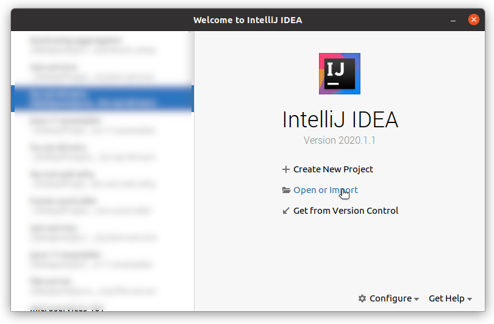
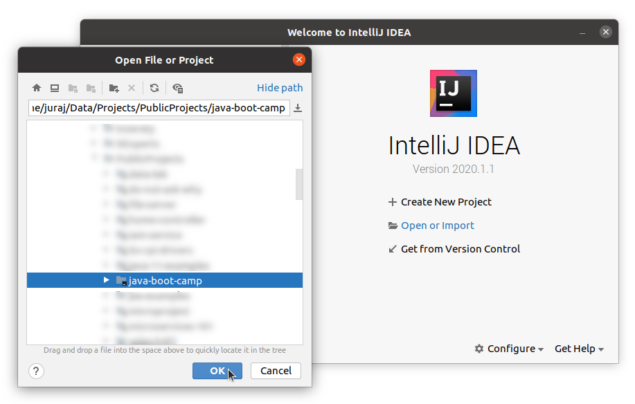
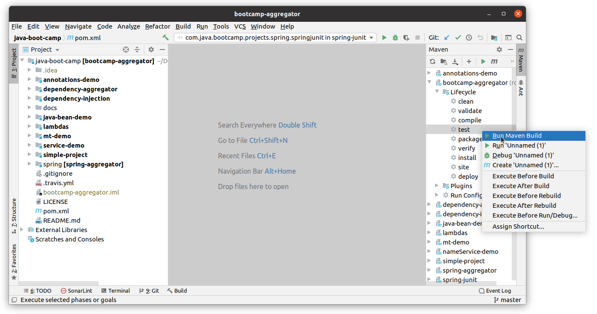
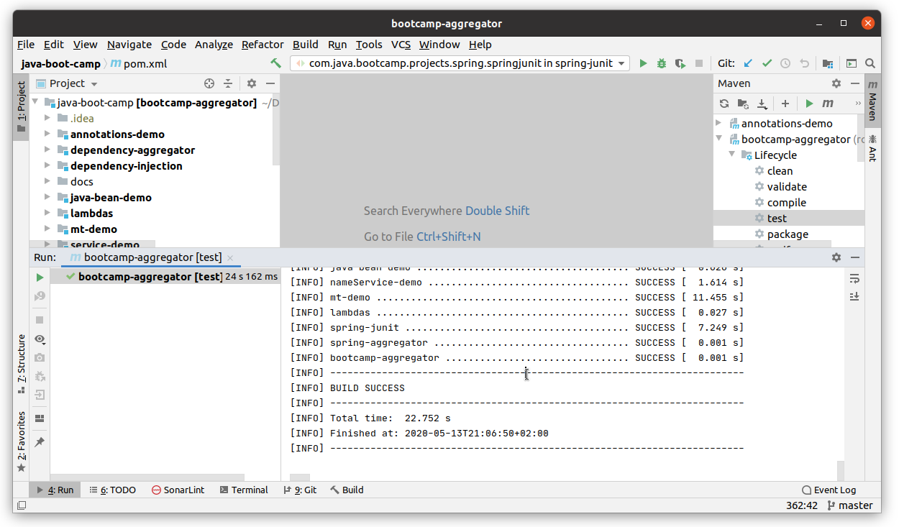

# IDE  Instructions
This simple guide is crafted for [IntelliJ IDEA](docs/ide-instructions.md) IDE.
Start IDE on your PC and follow instructions.

## 1. Open Project

## 2. Compile and Run Tests

## 3. Explore Examples and Lessons
Main __java-boot-camp__ project is actually 
[maven](https://maven.apache.org/) [multi-module](https://maven.apache.org/guides/mini/guide-multiple-modules.html) project.
Feel free to explore modules - [subprojects](../README.md).
